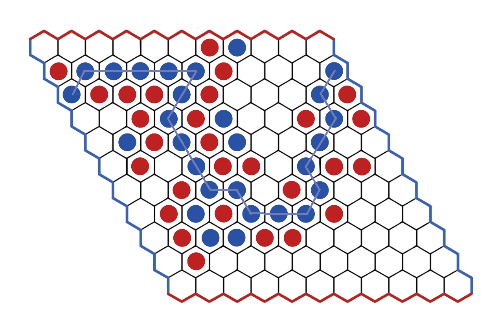

# myHex

## Aim: Simulate Hex game 
## TechStack: AI, Python, pygame

## Hex Game

-> Hex is a two player abstract strategy board game in which players attempt to connect opposite sides of a rhombus-shaped hex board. 
-> Hex is played on a board made of hexagons. The same board is shaped like a rhombus, as shown in the picture. The pieces are placed in the hexagons of the board. The board shown here has 11 tiles on each side of the diamond, which is a common size for experienced players, but the game can be played on any size board.

## Rules
-> Initially the board is empty.
-> Each player is assigned a color of tiles and two opposite sides of the board that they will have to try to connect with their tiles following the rules of the game.
-> The players take turns placing chips on the board in unoccupied squares.
-> The first player who manages to form a line of his pieces that connects his two sides wins.

## Target
The objective is to make a path with the pieces of your color between opposite sides (of the same color) of the board. The opposing player will try to make a chain between the sides of the other color of the board. The chain does not have to be in a straight line, as long as the chain is closed, that is, the chips are directly next to each other. In the game shown below, blue won.

